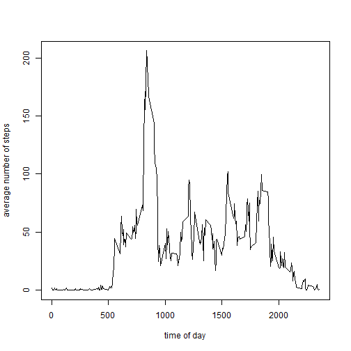

## Loading and preprocessing the data
This report takes a raw data set of activity data from wearable computing. More data 
can be found in the README accompanying at the following Github repository link
<https://github.com/domlloyd/RepData_PeerAssessment1>

Before running the report we will need to source the various R libraries used to produce the report


```r
# This script uses:
# - the "readr" library for fast reading of files using read_table
# - the "dplyr" library for summarising the data
# - the "stringr" library to use str_pad to pad the time strings
library("readr", quietly = TRUE, warn.conflicts = FALSE)
library("dplyr", quietly = TRUE, warn.conflicts = FALSE)
library("stringr", quietly = TRUE, warn.conflicts = FALSE)
```

And then we read the file of activity data, getting rid of NA values. 


```r
# the raw data has been unzipped to our RProject directory
# We setwd to the project directory we have forked. 
# NB If running this program make sure the raw data file
# household_power_consumption.txt hs been unzipped and put in to the
# working directory shown below.

setwd("..//RepData_PeerAssessment1")

# clear the workspace - we do this for ease of seeing which variables have been generated. 
rm(list=ls())

# read the activity file
activity_all <- read.table("activity//activity.csv", header = TRUE, sep = ",", stringsAsFactors = FALSE,
                           na.strings = "NA")

# filter out NA values for steps
activity_all_valid <- filter(activity_all, !is.na(steps))
activity_all_valid2 <- filter(activity_all, !is.na(steps))
activity_all_na    <- filter(activity_all, is.na(steps))
# pad the time taken from interval field
activity_all_valid$time <- str_pad(as.character(activity_all_valid$interval), width = 4, side = "left", pad = "0")
#activity_all_valid$datetime <- strptime(paste(activity_all_valid$date, activity_all_valid$time), '%Y-%m-%d %H%M')
```


## What is mean total number of steps taken per day?

First we will build a data table with the total number of steps per day


```r
# work out the total number of steps per day
total_steps_per_day <- summarise(group_by(activity_all_valid, date),
                                 sum_steps = sum(steps))
```


Then we can plot a histogram of the total number of steps over the activity days.

 


The mean number of steps per day is: 


```
## [1] 10766
```

and the median number of steps is: 

```
## [1] 10765
```


## What is the average daily activity pattern?
The following graph shows the average daily activity pattern by taking the averages across all days for the five minute periods. 
 

From the graph we can see the maximum number of steps occurring in a 5 minute interval in an average day is: 

```
## [1] 206.1698
```
And this peak number of steps occurs at

```
## Source: local data frame [1 x 2]
## 
##   times mean_steps
## 1  0835   206.1698
```


## Imputing missing values

We have come up with a method for filling in NA values with the average number of steps at interval


```r
averages <- aggregate(x=list(steps=activity_all$steps), by=list(interval=activity_all$interval),
                      FUN=mean, na.rm=TRUE)
merged <- merge.data.frame(activity_all_na,averages, by = c("interval"))
activity_all_na$steps <- merged$steps.y
final_data = rbind.data.frame(activity_all_na,activity_all_valid2)
```

Redo the sums from the original set 0f graphs. 


```r
# work out the total number of steps per day
total_steps_per_day2 <- summarise(group_by(final_data, date),
                                 sum_steps = sum(steps))
```


Then we can plot a histogram of the total number of steps over the activity days.

 


The mean number of steps per day is: 


```
## [1] 10766
```

and the median number of steps is: 

```
## [1] 11015
```
The median number of steps has gone higher because we have more values taken in to consideration in the calculation. 


## Are there differences in activity patterns between weekdays and weekends?


```r
final_data$day <- weekdays(strptime(final_data$date,'%Y-%m-%d'))
weekday_weekend <- function(day) {
    if (day %in% c("Monday", "Tuesday", "Wednesday", "Thursday", "Friday"))
        return("weekday")
    else if (day %in% c("Saturday", "Sunday"))
        return("weekend")
    else
        stop("invalid date")
}
final_data$weekend <- sapply(final_data$day, FUN=weekday_weekend)
```
  
  
  
